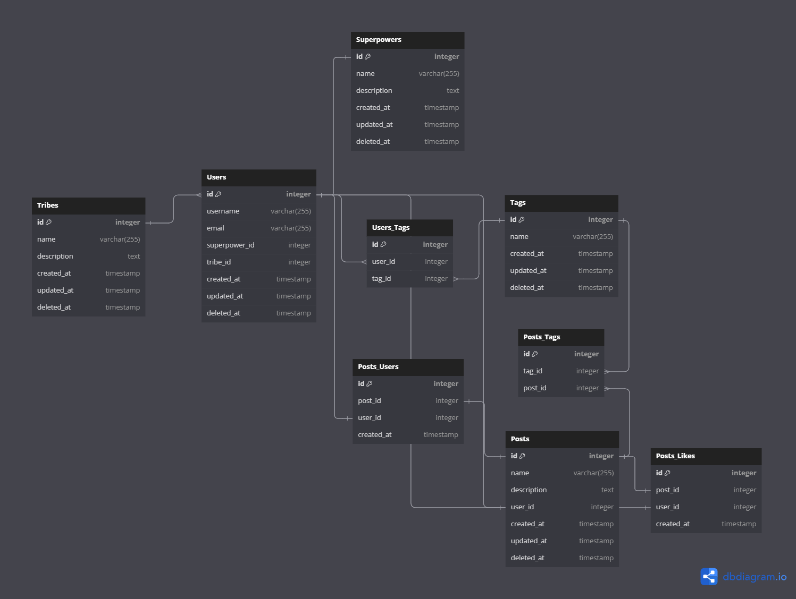

# 🤖 Ioasys Journey - Backend

Projeto desenvolvido durante o Ioasys Camp 2024, no qual visa desenvolver um produto de cultura para uma empresa determinada pelo time, sendo que essa solução digital deve norteada pelo guia de cultura da entidade empresarial escolhida. O projeto desenvolvido passa por um rigoroso critério de avaliação estipulado pelos profissionais da Ioasys, empresa promotora do Ioasys Camp, e, em um momento posterior, tal projeto participará de uma competição com outras soluções distintas para o mesmo tema em comum, produto de cultura. Para tal aplicação deu-se o nome de Ioasys Journey


## 🌲 Variáveis de Ambiente

Para rodar esse projeto, você vai precisar adicionar as seguintes variáveis de ambiente no seu .env:

`DB_DATABE`

`DB_HOST`

`DB_PORT`

`DB_USERNAME`

`DB_PASSWORD`

`JWT_SECRET`


## 🏠 Rodando localmente

Clone o projeto:

```bash
    git clone https://github.com/fariamg/iostraordinarios/tree/main/backend
```

Dentro da sua IDE, entre no diretório do projeto:

```bash
    cd backend
```

Instale as dependências:
```bash
    yarn install
```

Após conectar corretamente com seu banco de dados PostgreSql, e atualizar suas variáveis de ambiente no .env, rode as migrations:
```bash
    yarn migration:run
```

Assim, rode a aplicação:
```bash
    # development
    yarn run start

    # watch mode
    yarn run start:dev

    # production mode
    yarn run start:prod
```

Para rodar os testes do Jest: 
```bash
    # unit tests
    yarn run test
```
## 🛠️ Arquitetura do Sistema
Abaixo é apresentado o Diagrama Entidade Relacionamento da estrutura em questão: 


## 📱 Tecnologias Utilizadas
- **NestJS**: "Nest (NestJS) is a framework for building efficient, scalable Node.js server-side applications. It uses progressive JavaScript, is built with and fully supports TypeScript (yet still enables developers to code in pure JavaScript) and combines elements of OOP (Object Oriented Programming), FP (Functional Programming), and FRP (Functional Reactive Programming)."
- **PostgreSQL**: "PostgreSQL is a powerful, open source object-relational database system with over 35 years of active development that has earned it a strong reputation for reliability, feature robustness, and performance."
- **TypeORM**: "TypeORM is an ORM that can run in NodeJS, Browser, Cordova, PhoneGap, Ionic, React Native, NativeScript, Expo, and Electron platforms and can be used with TypeScript and JavaScript (ES2021). Its goal is to always support the latest JavaScript features and provide additional features that help you to develop any kind of application that uses databases - from small applications with a few tables to large-scale enterprise applications with multiple databases."
- **Node.js**: "Node.js® is a free, open-source, cross-platform JavaScript runtime environment that lets developers create servers, web apps, command line tools and scripts."
- **JWT Token**: "JSON Web Token (JWT) is an open standard (RFC 7519) that defines a compact and self-contained way for securely transmitting information between parties as a JSON object. This information can be verified and trusted because it is digitally signed. JWTs can be signed using a secret (with the HMAC algorithm) or a public/private key pair using RSA or ECDSA."
- **Swagger**: "The Swagger tools were developed by the team behind the original "Swagger" Specification. Swagger offers the most powerful and easiest to use tools to take full advantage of the OpenAPI Specification."
- **Postman**: "Postman is an API platform for building and using APIs. Postman simplifies each step of the API lifecycle and streamlines collaboration so you can create better APIs—faster."
- **Render**: "Render is a unified cloud to build and run all your apps and websites with free TLS certificates, global CDN, private networks and auto deploys from Git."
- **DBeaver**: "DBeaver Community is a free cross-platform database tool for developers, database administrators, analysts, and everyone working with data. It supports all popular SQL databases like MySQL, MariaDB, PostgreSQL, SQLite, Apache Family, and more."


*** Descrições fornecidas pelo website oficial das tecnologias citadas ***

## 🔗 Bibliotecas
Aqui temos as bibliotecas utilizadas no projeto:
### Dependencies
    "@nestjs/common": "^10.3.8"
    "@nestjs/config": "^3.2.2"
    "@nestjs/core": "^10.0.0"
    "@nestjs/jwt": "^10.2.0"
    "@nestjs/mapped-types": "^2.0.5"
    "@nestjs/platform-express": "^10.0.0"
    "@nestjs/swagger": "^7.3.1"
    "@nestjs/typeorm": "^10.0.2"
    "@types/passport-jwt": "^4.0.1"
    "@types/passport-local": "^1.0.38"
    "bcrypt": "^5.1.1"
    "class-transformer": "^0.5.1"
    "class-validator": "^0.14.1"
    "dotenv": "^16.4.5"
    "passport": "^0.7.0"
    "passport-jwt": "^4.0.1"
    "passport-local": "^1.0.0"
    "pg": "^8.11.5"
    "reflect-metadata": "^0.2.0"
    "rxjs": "^7.8.1"
    "typeorm": "^0.3.20"

### devDependencies
    "@nestjs/cli": "^10.3.2",
    "@nestjs/schematics": "^10.0.0",
    "@nestjs/testing": "^10.0.0",
    "@types/bcrypt": "^5.0.2",
    "@types/express": "^4.17.17",
    "@types/jest": "^29.5.12",
    "@types/node": "^20.3.1",
    "@types/supertest": "^6.0.0",
    "@typescript-eslint/eslint-plugin": "^6.0.0",
    "@typescript-eslint/parser": "^6.0.0",
    "eslint": "^8.42.0",
    "eslint-config-prettier": "^9.0.0",
    "eslint-plugin-prettier": "^5.0.0",
    "jest": "^29.5.0",
    "prettier": "^3.0.0",
    "source-map-support": "^0.5.21",
    "supertest": "^6.3.3",
    "ts-jest": "^29.1.0",
    "ts-loader": "^9.4.3",
    "ts-node": "^10.9.1",
    "tsconfig-paths": "^4.2.0",
    "typescript": "^5.1.3"  
## 📚 Documentação da API
Para uma visão detalhada e interativa de todos os endpoints da nossa API, visite nossa documentação do Render:

https://ioasys-journey-2.onrender.com/api

### Como usar a Documentação Swagger

- Acesse o link acima para abrir a documentação da API.
- Navegue pelos diferentes endpoints listados para ver os métodos HTTP disponíveis e os parâmetros necessários.
- Para testar um endpoint, clique no método (por exemplo, GET, POST) para expandir os detalhes.
- Se necessário, forneça os parâmetros requeridos e clique em "Try it out".
- Após configurar os parâmetros, clique em "Execute" para fazer uma chamada à API diretamente da documentação e ver a resposta em tempo real.
## ✏️ Autores

- [@daviferreiradev](https://github.com/daviferreiradev)
- [@fariamg](https://github.com/fariamg)
